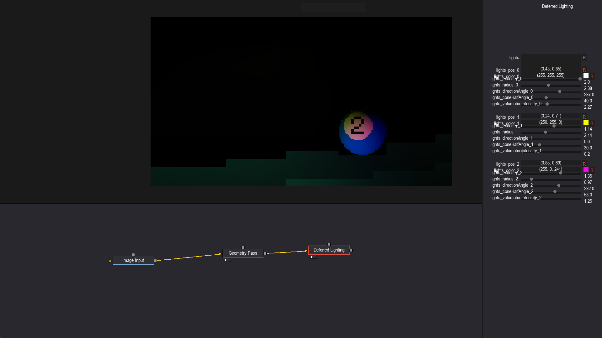
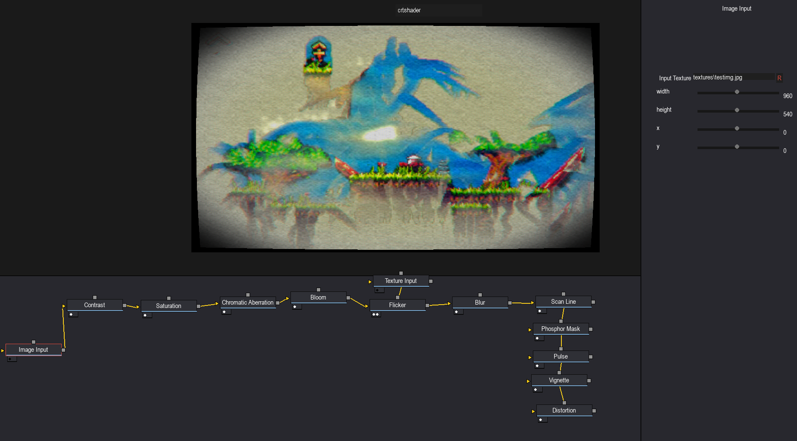

# PygameShaders
Initially, a repo for me to learn shader programming, 
turned into a full-fledged shader editor, allowing you to connect nodes, and create beautiful images.
Essentially, you connect nodes via a graph-like interface similar to the Davinci Resolve fusion page and you can view your output.

Uses pygame + GLSL.

The name of this shader editor is the Lumos engine.

  
  

